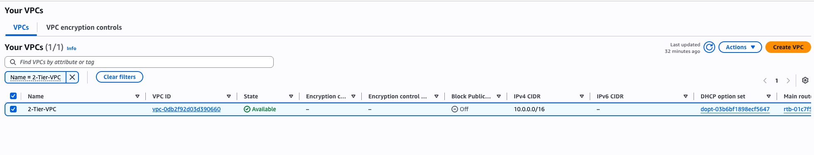
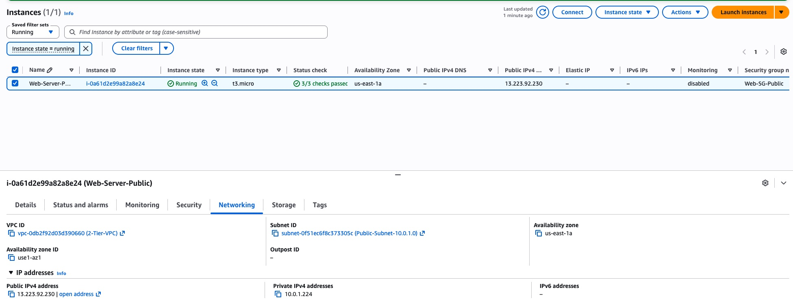
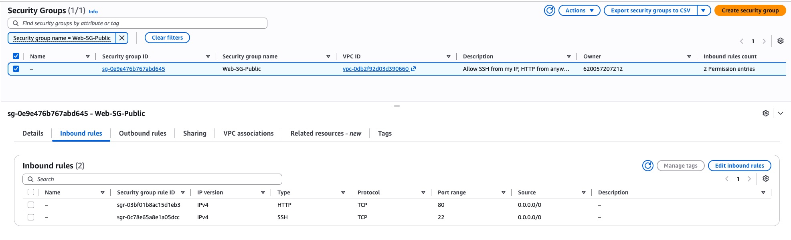
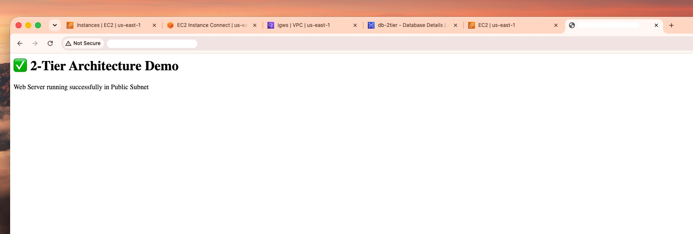

# 🛡️ AWS 2‑Tier Architecture
Secure, production‑ready 2‑tier web + database architecture deployed on AWS Free Tier, following cloud security best practices.

---

## 🎯 Project Goal
Design and implement a standard production‑grade architecture that:
- Separates **public‑facing web services** from **private backend data storage**
- Improves security by isolating the database from direct public access
- Demonstrates core AWS networking, compute, and database concepts
- Proves understanding of least‑privilege access and network segmentation
- Fully eligible for AWS Free Tier with no unexpected costs

---

## 🧱 Architecture Diagram

---

## 📋 Core Components
| Component | Purpose | Security Design |
|---|---|---|
| **Custom VPC** | Isolated private network | Uses private CIDR `10.0.0.0/16` |
| **Public Subnet** | Hosts web server | Auto‑assigns public IP; routes internet traffic |
| **Private Subnet** | Hosts database | No public IPs; fully isolated |
| **Internet Gateway** | Connects VPC to internet | Linked only to public subnet route table |
| **Web Security Group** | EC2 traffic rules | Allows HTTP (80) from anywhere; SSH (22) for admin |
| **DB Security Group** | RDS traffic rules | Allows MySQL (3306) **only from the web server** |
| **EC2 t3.micro** | Runs Apache | Amazon Linux 2023; Free Tier eligible |
| **RDS MySQL** | Database storage | No public access; `db.t3.micro` Free Tier eligible |

---

## 📸 Screenshots & Explanations

### 1. VPC & Networking Setup

*Custom VPC created with separate public and private subnets, plus attached Internet Gateway for controlled public access.*

### 2. Web Server Deployment

*EC2 instance successfully running in the public subnet with assigned public IPv4 address — fixed after initial placement in the private subnet.*

### 3. Security Configuration

*Least‑privilege rules applied: web server open to necessary traffic; database locked down to accept connections only from the web tier.*

### 4. Live Web Access

*Apache web server installed and running on Amazon Linux 2023, serving content publicly over HTTP.*

### 5. Database Connectivity

*Confirmed web server can reach the private RDS database — proving network segmentation and security rules work correctly.*

---

## ✅ Key Learnings
- Public vs private subnet design and routing
- How security groups control traffic between AWS resources
- OS differences: Amazon Linux 2023 uses `dnf` instead of `yum`
- Best practice: never expose databases directly to the internet
- Full end‑to‑end 2‑tier architecture implementation

---

## 🛠️ Technologies
AWS VPC, EC2, RDS MySQL, Security Groups, Internet Gateway, Apache, Amazon Linux 2023

---

**Author:** bmeshun-star
**Status:** ✅ Fully completed and verified
